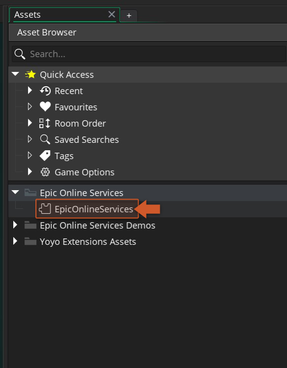

@title Setup Guide

# Setup Guide

To use the Epic Online Services API extension you should follow these steps:

1. Import this Epic Online Services extension into your project, if you haven't done that already.
2. The Epic Launcher App needs to be **installed** , **running** and with an account **logged in** ([official site](https://store.epicgames.com/en-US/download)).
3. Download Epic Online Services SDK (C version, 1.15.4) from Epic's [Developer Portal](https://dev.epicgames.com/portal/en-US/) and extract the contents of the zip into a directory of your choice (e.g.: `C:\epic_online_services\SDK`).
      

4. To set up your game properties, double click on the EpicOnlineServices extension in your Asset Browser in the IDE.
      

5. At the bottom of the extension widow you will find all the configurable options of the Epic Online Services.
      

6. The options are split in two sections **Building Properties** and **Game Properties** . The first one is a folder path that should point to the extracted folder of step 3, the second section will allow you to configure all the settings that are required for running and publishing a game to Epic Store.

[[Note: If you set **Debug Mode** to `false` this will force your app to be launched by the EOS launcher. This should only be used when you are ready to send your app to production (DO NOT try to run the game from the IDE while debug mode is disabled).]]
