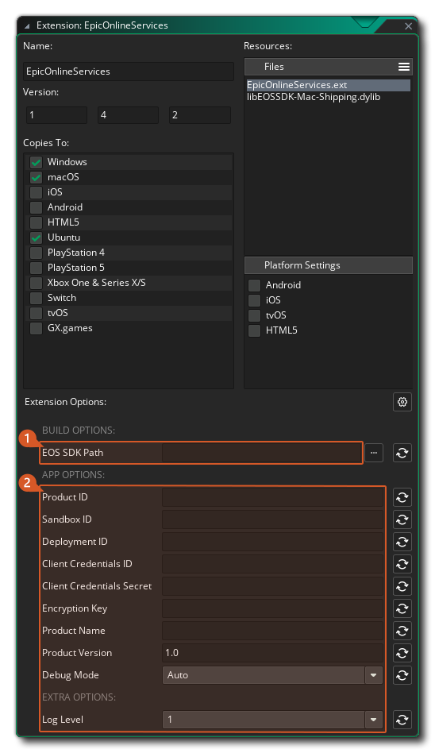

@title Setup Guide

# Setup Guide

To use the Epic Online Services API extension you should follow these steps:

1. Import this Epic Online Services extension into your project, if you haven't done that already.
2. The Epic Launcher App needs to be **installed**, **running** and with an account **logged in** ([official site](https://store.epicgames.com/en-US/download)).
3. Download Epic Online Services SDK (C version, 1.16.3) from Epic's [Developer Portal](https://dev.epicgames.com/portal/en-US/) and extract the contents of the zip into a directory of your choice (e.g.: `C:\epic_online_services\SDK`).
      

4. To set up your game properties, double click on the EpicOnlineServices extension in your Asset Browser in the IDE.
      

5. At the bottom of the extension window you will find all the configurable options of the Epic Online Services.
      

6. The options are split into two sections: **Building Properties** and **Game Properties** . The first one is a folder path that should point to the extracted folder of step 3, the second section will allow you to configure all possible settings for running and publishing a game to Epic Store. The **Product Name**, **Product ID**, **Sandbox ID** and **Deployment ID** must be set.

[[Note: If you set **Debug Mode** to `Enabled` this will NEVER force your app to be launched by the EOS launcher. This should only be used when in some rare cases you want to send a standalone copy to someone for test purposes (when in production DO NOT set this to `Enabled`).]]

# Deployment and Sandbox IDs

On Epic Games products in your organisation are organised in a [hierarchy](https://dev.epicgames.com/docs/dev-portal/dev-portal-intro#your-organization-and-products) of deployments inside different sandboxes. The extension needs to know the deployment to look for and the sandbox environment it's in (see [Select Deployment ID](https://dev.epicgames.com/docs/epic-games-store/store-presence/manage-artifacts#step-5-select-deployment-id-for-epic-online-services-only)). It determines this as follows:

1. By default, the **Sandbox ID** and **Deployment ID** set in the extension options are used.
2. When the game is launched from the Epic Games Launcher, the sandbox and deployment ID are passed to the extension as command line parameters, overriding the values set in the extension options.
3. The Epic Online Services SDK is initialised.
4. If the game is not running from the IDE, the extension calls the function ${function.eos_platform_check_for_launcher_and_restart} and ends the game.

