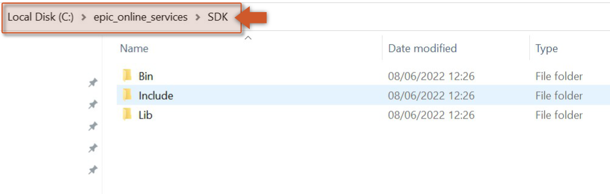
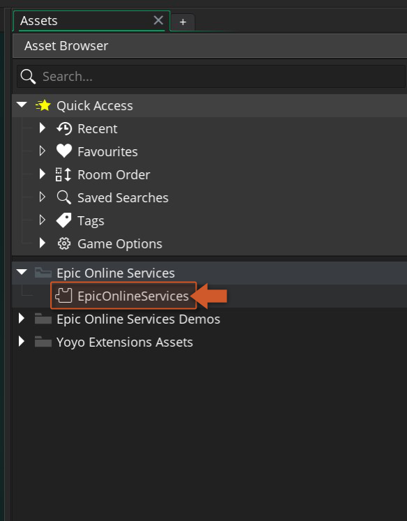
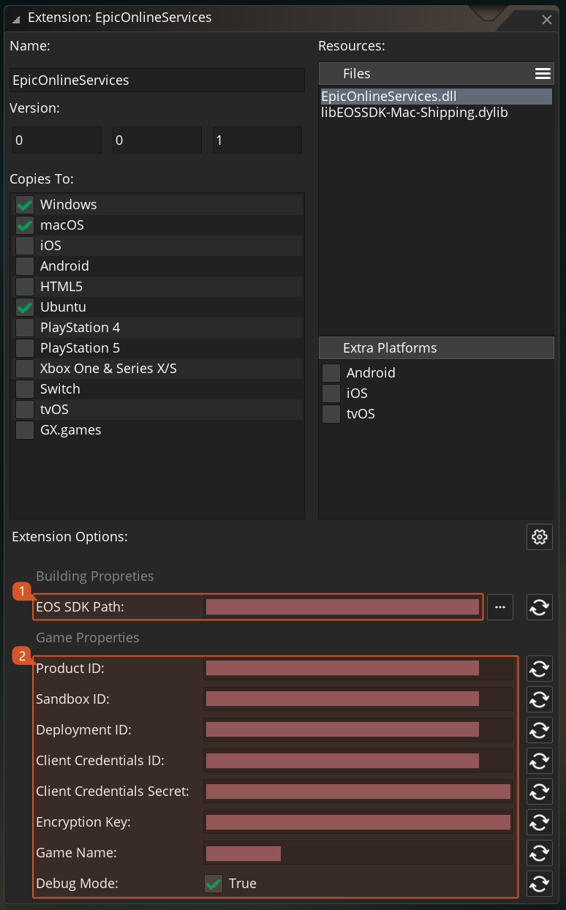

@title Getting Started

# Getting Started

To use the Epic Online Services extension, follow these steps:

1. Import this Epic Online Services extension into your project, if you haven't done that already.
2. The Epic Games Launcher needs to be **installed**, **running**, and with an account **logged in**
   ([official site](https://store.epicgames.com/en-US/download)) while testing from the IDE.
3. Download the Epic Online Services SDK (C version) from Epic's
   [Developer Portal](https://dev.epicgames.com/portal/en-US/) and extract it into a directory of your
   choice (e.g. `C:\epic_online_services\SDK`).
      
4. To configure the extension, double click on the EpicOnlineServices extension in your Asset Browser in
   the IDE.
      
5. At the bottom of the extension window you'll find every configurable option, grouped into **Build
   Options**, **App Options**, **Extra Options**, and **Android**.
      

   The **EOS SDK Path** options should point at the folder(s) you extracted in step 3. The **Product
   Name**, **Product Version**, **Product ID**, **Sandbox ID**, and **Deployment ID** app options must all
   be set, found on the [Dev Portal](https://dev.epicgames.com/portal/en-US/). Full details on every
   option: ${page.extension_options}.

[[Note: If you set **Debug Mode** to `Enabled`, your app will never be relaunched through the Epic
Launcher by ${function.eos_platform_check_for_launcher_and_restart}. Only use this to hand a standalone
build to someone for testing - never ship a store build with it `Enabled`.]]

# Initializing

Initializing this extension is two calls, made once at the start of your game (e.g. a persistent
controller object's Create event):

```gml
var _init = eos_api_initialize("MyGame", "1.0.0");

if (_init != EpicResult.Success)
{
    show_debug_message("EOS init failed: " + eos_api_last_error());
    return;
}

var _platform = eos_platform_create(working_directory);

if (_platform != EpicResult.Success)
{
    show_debug_message("Platform creation failed: " + eos_api_last_error());
    return;
}
```

${function.eos_api_initialize} starts the SDK itself; ${function.eos_platform_create} then creates the
platform handle every other module needs, reading your **Product ID**/**Sandbox ID**/**Deployment
ID**/**Client Credentials ID**/**Client Credentials Secret** straight from the extension options you set
above - you don't pass them in code. Check ${function.eos_api_last_error} whenever either call doesn't
return `EpicResult.Success`.

[[Warning: Register any persistent `add_notify_*` callback (${module.auth}, ${module.connect},
${module.friends}, etc.) only AFTER ${function.eos_platform_create} succeeds. Each interface's notify
registration silently no-ops (returns an invalid notification ID) until the platform exists.]]

# Ticking and shutting down

${function.eos_platform_tick} drives the SDK - call it every step, or nothing will ever complete or fire
a callback:

```gml
/// Step Event
eos_platform_tick();
```

Call ${function.eos_api_shutdown} once, when your game closes - it releases the platform handle for you:

```gml
/// Game End Event / Clean Up Event
eos_api_shutdown();
```

# Handling launcher requirements

Most login flows expect your game to have been launched through the Epic Games Launcher. Call
${function.eos_platform_check_for_launcher_and_restart} once, after the platform is created, to relaunch
through the launcher automatically if it wasn't:

```gml
if (eos_platform_check_for_launcher_and_restart() == EpicResult.Success)
{
    game_end();
}
```

See ${page.logging_in} for the full login flow once your platform is up and running.
